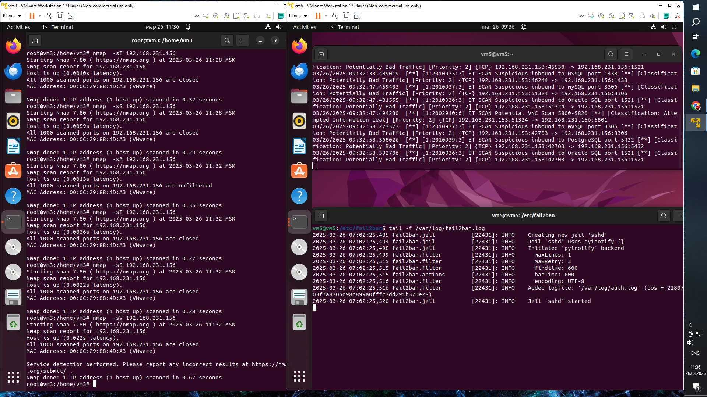

# Домашнее задание к занятию «Защита сети»

Подготовка к выполнению заданий

Подготовка защищаемой системы:

установите Suricata,

установите Fail2Ban.

Подготовка системы злоумышленника: установите nmap и thc-hydra либо скачайте и установите Kali linux.

Обе системы должны находится в одной подсети.

# Задание 1
Проведите разведку системы и определите, какие сетевые службы запущены на защищаемой системе:

sudo nmap -sA < ip-адрес >

sudo nmap -sT < ip-адрес >

sudo nmap -sS < ip-адрес >

sudo nmap -sV < ip-адрес >

По желанию можете поэкспериментировать с опциями: https://nmap.org/man/ru/man-briefoptions.html.

В качестве ответа пришлите события, которые попали в логи Suricata и Fail2Ban, прокомментируйте результат.

## Ответ

sudo nmap -sA <ip-адрес> — это сканирование для определения каждого открытого порта, которое использует ACK-запросы. Этот метод может помочь определить, какие порты открыты или закрыты, не поднимая флаг TCP handshake.

Пакет запроса при таком типе сканирования содержит установленным только ACK флаг (если не используется --scanflags). При сканировании нефильтруемых систем, открытые и закрытые порты оба будут возвращать в ответ RST пакет. Nmap помечает их как не фильтруемые, имея ввиду, что они достижимы для ACK пакетов, но неизвестно открыты они или закрыты. Порты, которые не отвечают или посылают в ответ ICMP сообщение об ошибке (тип 3, код 1, 2, 3, 9, 10 или 13), помечаются как фильтруемые.

sudo nmap -sT <ip-адрес> — это полное сканирование TCP (connect scan). Это менее скрытный метод, который пытается установить полное TCP-соединение с целевым портом.

При доступности SYN сканирования, оно, безусловно, будет являться лучшм выбором. У Nmap имеется меньше возможностей контролирования высокоуровнего вызова connect по сравнению с сырыми пакетами, что делает его менее эффективным. Системный вызов завершает соединения по открытым портам, вместо того, чтобы использовать полуоткрытые соединения, как в случае с SYN сканированием. Таким образом на получение той же самой информации потребуется больше времени и пакетов, да к тому же целевые машины скорее всего запишут это соединение в свои логи. То же самое сделает и порядочная IDS, хотя большинство машин не имеют такой системы защиты. Многие службы на вашей Unix системе будут добавлять запись в системный лог (syslog), а также сообщение об ошибке, когда Nmap будет устанавливать и закрывать соединение без отправления данных. Некоторые службы даже аварийно завершают свою работу, когда это происходит, хотя это не является обычной ситуацией. Администратор, который увидит в логах группу записей о попытке установки соединения от одной и той же системы, должен знать, что его машина подверглась такому типу сканирования.

sudo nmap -sS <ip-адрес> — это полуанонимное сканирование SYN (SYN scan), которое отправляет только SYN-пакеты для определения открытых портов, не завершая TCP handshake. Это часто используется для "тихого" сканирования.

Эту технику часто называют сканированием с использованием полуотрытых соединений, т.к. вы не открываете полного TCP соединения. Вы посылаете SYN пакет, как если бы вы хотели установить реальное соединение и ждете. Ответы SYN/ACK указывают на то, что порт прослушивается (открыт), а RST (сброс) на то, что не прослушивается. Если после нескольких запросов не приходит никакого ответа, то порт помечается как фильтруемый. Порт также помечается как фильтруемый, если в ответ приходит ICMP сообщение об ошибке недостижимости (тип 3, код 1,2, 3, 9, 10 или 13).

sudo nmap -sV <ip-адрес> — это сканирование для определения версий служб, работающих на открытых портах.

# Задание 2

Проведите атаку на подбор пароля для службы SSH:

hydra -L users.txt -P pass.txt < ip-адрес > ssh

Настройка hydra: создайте два файла: users.txt и pass.txt; в каждой строчке первого файла должны быть имена пользователей, второго — пароли. В нашем случае это могут быть случайные строки, но ради эксперимента можете добавить имя и пароль существующего пользователя. Дополнительная информация по hydra: https://kali.tools/?p=1847.

Включение защиты SSH для Fail2Ban: открыть файл /etc/fail2ban/jail.conf, найти секцию ssh, установить enabled в true. Дополнительная информация по Fail2Ban:https://putty.org.ru/articles/fail2ban-ssh.html.

В качестве ответа пришлите события, которые попали в логи Suricata и Fail2Ban, прокомментируйте результат.

## Ответ
